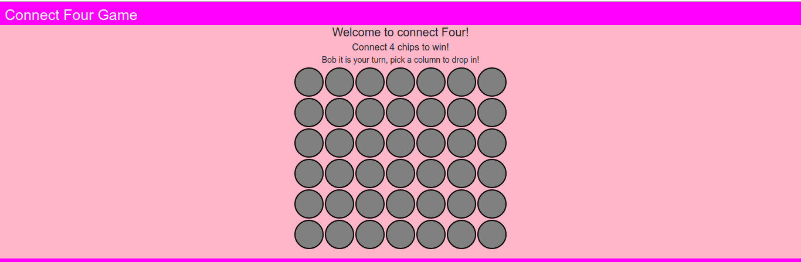
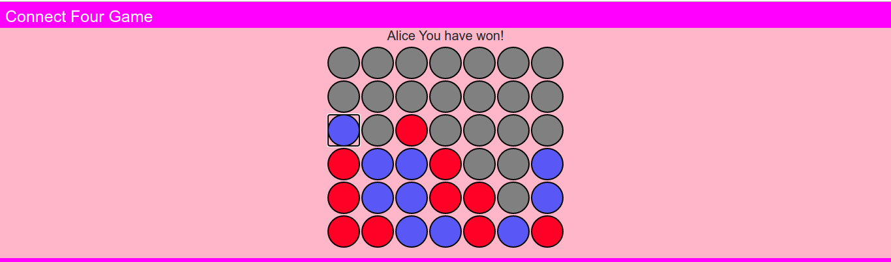

# Connect Four Game 🎮

A simple yet engaging two-player **Connect Four** game built with JavaScript and jQuery—perfect for sharpening your web development skills!

## 🚀 About the Project

Challenge a friend and relive the fun of the classic Connect Four right in your browser! Two players alternate turns dropping colored discs into a vertical grid. The objective? Be the first to connect four discs—horizontally, vertically, or diagonally.  
Easy to play, impossible to resist!

## ✨ Features

- **Dual-Player Mode:**  
  Compete with a friend on the same computer.
- **Color-Coded Discs:**  
  ❤️ Player 1 — Red discs  
  💛 Player 2 — Yellow discs
- **Smart Win Detection:**  
  Instantly checks and announces the winner after every move.
- **Clean, Simple User Interface:**  
  Straightforward design that focuses on seamless gameplay.

## 🛠️ Technologies Used

- **HTML:** Provides the robust structure for the game board.
- **CSS:** Styles the board and pieces for a vibrant, inviting look.
- **JavaScript:** Powers game logic, input handling, and win detection.
- **jQuery:** Simplifies DOM manipulation for smooth, responsive play.

## ➡️ How to Play

1. **Clone the repository:**
    ```
    git clone https://github.com/vishalkad/connect-four-game.git
    ```
2. **Navigate to the project folder and open _index.html_ in your web browser.**
3. **Player 1 (Red) moves first. Click any column to drop your piece.**
4. **Alternate turns with your opponent.**
5. **First to align four discs in a row (horizontal/vertical/diagonal) wins!**
6. **A message will announce the winner.**

## 📸 Screenshots

A picture is worth a thousand words! You can find screenshots of the game in the ScreenShots/ directory.




## How to run locally?
* Just clone the repository and open index.html file, you are good to go.
* 
## 🧑💻 Author

**Vishal Kadalagi**

## 📄 License

This project is **open-source** and released under the [MIT License](LICENSE).

**Enjoy the game and happy coding!**


